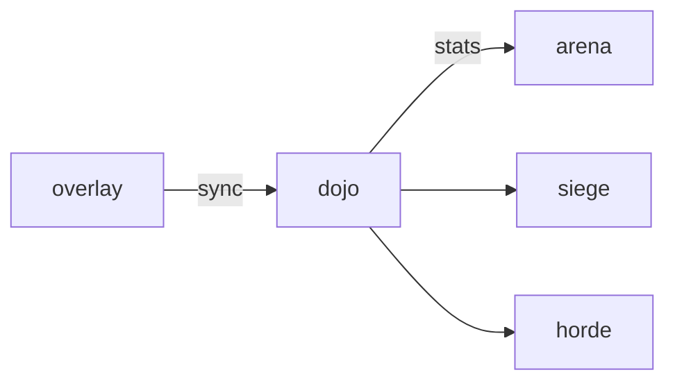

# Dojo

**Pet Dojo Training** — Clicker / idle gym: pets hit dummies to raise base stats under a daily cap.

Part of [ComputerPets](https://github.com/RicheyWorks/computerpets). Map: [computerpets-ecosystem](https://github.com/RicheyWorks/computerpets-ecosystem).

| | |
| --- | --- |
| Status | Design scaffold — loop and engine frozen |
| License | MIT |
| Tokens | Minigames never mint or burn. Tired overlay, not a dead lineage. |
| First pet | [Meet Rui first](https://github.com/RicheyWorks/computerpets/blob/main/docs/START-HERE.md). This game is optional. |

## The loop

Without a cap this becomes pay-or-click-forever. Dojo is the honest grind: small, capped, visible on the overlay as 'trained today'. Arena, Siege, Horde all read these numbers.

## Who plays

Every combat game reads these numbers. Daily caps are the point.

## What it is not

An uncapped clicker. Overcap XP is steam, not power. Bots decay.

## Genre and engine

- Genre: **Idle clicker**
- Engine: **Svelte**
- Stack: Svelte 5 · idle tick · dummy targets · writes into overlay base stats with daily caps
- Default surface: `5173`

## Architecture



## How you play

1. Park a pet on a dummy.
2. Click for burst XP, idle for drip.
3. Daily cap per stat (shown).
4. Overcap XP converts to flavor steam, not power.

## First slice

Build this and stop.

**Park Rui on a dummy, click + idle drip, show remaining cap, write to overlay stats.**

You know it works when: Bot clicks decay. Cap bypass rejected. Overlay offline: queue remaining cap.

## Environment

Node 22

## Failure doctrine

Bot clicks → exponential decay. Cap bypass attempt → reject write. Overlay offline → queue the day's remaining cap, apply on sync.

Canon rules that never yield:

- 210 living kinds. No illegal hybrids.
- Overlay pets can get tired, sick, or hide. Tokens are not burned by a minigame.
- Desktop walk stays the main quest. Closing Dojo must leave Rui walking.

## Neighbors

- computerpets (base stats)
- computerpets-arena
- computerpets-siege
- computerpets-horde
- computerpets-quests

## Layout

```
computerpets-dojo/
  README.md
  LICENSE
  docs/DESIGN.md
  src/                implementation lands here
```

## Run (Windows)

```powershell
cd app; npm install; npm run dev
```

Meet Rui first via the [flagship start-here](https://github.com/RicheyWorks/computerpets/blob/main/docs/START-HERE.md). This game is optional.

## Links

- Flagship: [RicheyWorks/computerpets](https://github.com/RicheyWorks/computerpets)
- This repo: [RicheyWorks/computerpets-dojo](https://github.com/RicheyWorks/computerpets-dojo)
- Map: [RicheyWorks/computerpets-ecosystem](https://github.com/RicheyWorks/computerpets-ecosystem)
- Design file: [docs/DESIGN.md](docs/DESIGN.md)

## License

MIT. See [LICENSE](LICENSE).

---

*Two hundred ten living kinds. Keep them so a line does not go quiet.*
