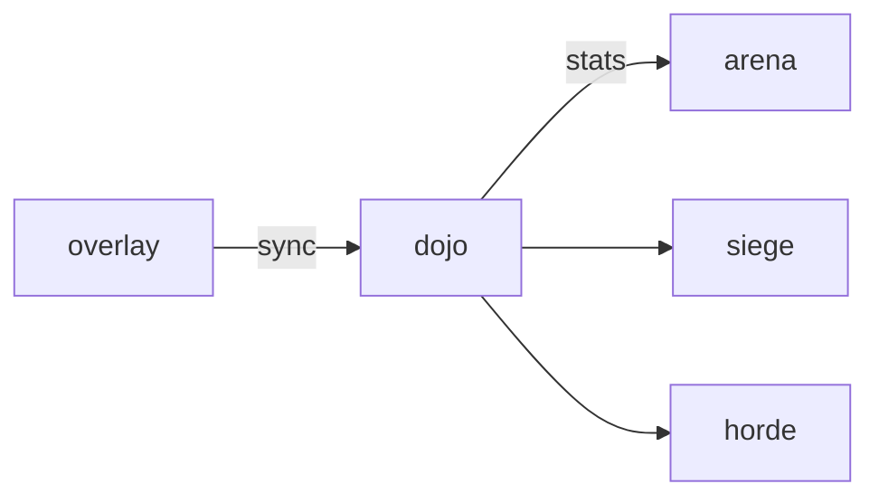

# Dojo

**Train a little. See the daily cap.**

A planned idle training game where click and idle progress raise pet stats within visible daily limits.

**Stage: design scaffold.** This checkout contains a design document and a source placeholder. The experience below is planned; there is no runnable app or integrated service yet.

[Status](#status) · [Planned experience](#planned-experience) · [Contributor quickstart](#contributor-quickstart) · [Game design](docs/DESIGN.md) · [Ecosystem map](https://github.com/RicheyWorks/computerpets-ecosystem)

## Status

| Available today | What you can inspect |
| --- | --- |
| [Game design](docs/DESIGN.md) | Intended behavior, boundaries, and planned dependencies. |
| [Source placeholder](src/index.ts) | Name metadata only; no package.json, app, or runtime is checked in. |
| [MIT license](LICENSE) | Licensing terms for the repository. |

Gameplay, endpoints, integration arrows, and failure handling on this page describe implementation targets. No build/test harness, CI workflow, or product screenshots are included in this scaffold.

## Planned experience

- Park a pet on a dummy.
- Click for burst XP, idle for drip.
- Daily cap per stat (shown).
- Overcap XP converts to flavor steam, not power.

### Planned technology

- Genre: **Idle clicker**
- Engine: **Svelte**
- Stack: Svelte 5 · idle tick · dummy targets · writes into overlay base stats with daily caps
- Default surface: `5173`

### Planned connections

These arrows show intended dependencies, rather than working integrations.



## Contributor quickstart

With access to this private repository, Git and PowerShell are enough to review the scaffold:

```powershell
git clone https://github.com/RicheyWorks/computerpets-dojo.git
Set-Location computerpets-dojo
Get-Content docs/DESIGN.md
Get-Content src/index.ts
```

Read [Game design](docs/DESIGN.md) before choosing implementation details. The commands above inspect the checked-in files; app installation, editor launch, and server startup become possible after a buildable project and entry point are added.

### First implementation target

**Park Rui on a dummy, click + idle drip, show remaining cap, write to overlay stats.**

You know it works when: Bot clicks decay. Cap bypass rejected. Overlay offline: queue remaining cap.

Treat this as an acceptance target for a future implementation. Start with the documented slice, add the required project setup and focused tests, and update these instructions with commands that work from a fresh clone.

## Design boundaries

1. Minigames cannot mint or burn NFTs by themselves (Minter is the write path).
2. Stats come from lived overlay care + Dojo caps, not cash shop.
3. Species kits stay inside Lore. Illegal hybrids never spawn.
4. Fail soft: the desktop overlay process is not this process.

**Required failure behavior:**

Bot clicks → exponential decay. Cap bypass attempt → reject write. Overlay offline → queue the day's remaining cap, apply on sync.

## Ecosystem

- [computerpets](https://github.com/RicheyWorks/computerpets) (base stats)
- [computerpets-arena](https://github.com/RicheyWorks/computerpets-arena)
- [computerpets-siege](https://github.com/RicheyWorks/computerpets-siege)
- [computerpets-horde](https://github.com/RicheyWorks/computerpets-horde)
- [computerpets-quests](https://github.com/RicheyWorks/computerpets-quests)

Start with the [ComputerPets flagship](https://github.com/RicheyWorks/computerpets) for the desktop pet. This repository describes an optional extension; the [ecosystem map](https://github.com/RicheyWorks/computerpets-ecosystem) explains the broader plan.

## License

MIT. See [LICENSE](LICENSE).
